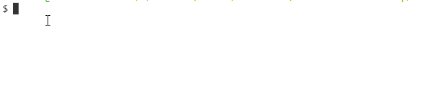

# Backend construído com Javascript e NodeJS

Aplicação backend, com base de dados [MongoDB Atlas](https://www.mongodb.com/download-center) para servir a outras duas aplicações ([React](https://reactjs.org/) e [React Native](https://facebook.github.io/react-native/))

1) Clone este projeto
```sh
git clone https://github.com/kaichiro/tendev-backend.git
```
2) Execute este comando para iniciar o projeto
```sh
yarn dev
```

